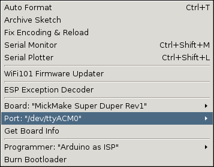

# Project - Super Duper
This dir contains Arduino IDE board support for the Super Duper.

## Quick start

### 1. Run the Arduino IDE
Fire up the Arduino IDE.

### 2. Additional Boards Manager URLs
Go to File -> Preferences

In the section marked `Additional Boards Manager URLs` ...

Add the following entry: `https://www.mickmake.com/SuperDuper/package_mickmake_index.json` and click OK.

### 3. Search for the board
Under Tools -> Board -> Boards Manager

Enter in `MickMake` into the search field.

### 4. Install the board

Select the package, and then click on `Install`

Then click OK when finished.

### 5. Select the board

Go back to Tools -> Board -> Boards Manager and scroll down to select the Super Duper Board.

Go back to Tools and check that it has been selected.

